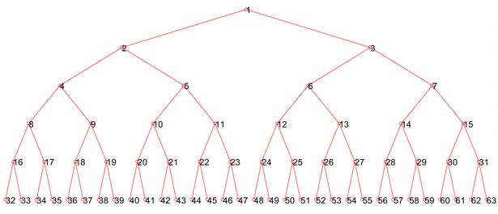

# Symbolic Regression

### Tree Structure

The original data (funciton1.csv) lists 1000 points with their X and Y locations on axes. After importing this matrix into MATLAB, its X values are extracted for estimation and its Y values are reserved for validation. A proposed 63 nodes Expression Tree (63-nodes tree) is created. Any node is able to hold the X values, a random number, or an operator. The X values are 1000 fixed numbers and are contained inside an array, so this array is indicated as X in this assignment. The random number can be any real constant within the range of ±10, and the operator is picked from plus, minus, divide, multiply, sine, and cosine.   

A parent node n is linked with two successors 2n and 2n+1. Not all 63 nodes will be involved in the analysis; only if the parent node is an operator, its successors will be counted. Two tree styles will be carried out: one is the 63-nodes tree, and the other one is an effective tree containing all analytical used nodes extracted from its 63-nodes tree. The effective tree contains multiple Xs, constants, and operators, and an equation Y(X) can be formed by reading nodes from the bottom to the top of the tree.  

Recursive functions are robust of finding parameters and solving the equation. By altering the combination of the parameters, a new solution can be achieved at each evaluation. The distance between a predicted value from Y(X) and a given value from input Y locations can be calculated, and a fitness is the sum of all these distances in the evaluation.  

Genotype is the combinations of different parameters in its effective tree, leading to different equations. Phenotype is the fitness of the sum of all points’ distances. If an evaluation outputs a better result, shorter distances between points, the combinations and the parameters will be expected to be kept. Three evolutionary methods: Random Search, Hill Climber, and Genetic Programming (EA Variation Operators and EA Selection Methods) will be described. Random Search does not keep the evolutionary tree, so it will be used as a baseline to assess others’ performances.

